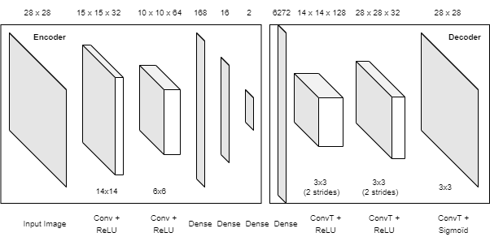
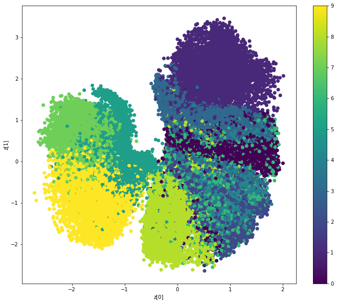
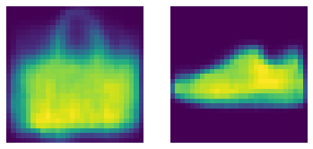
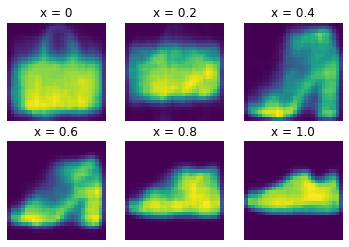
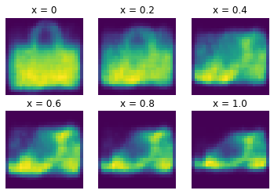
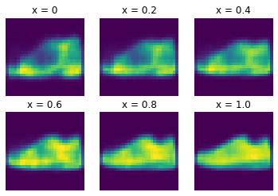
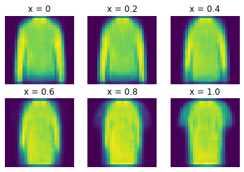
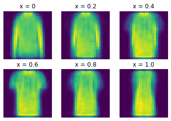

# :bar_chart: Auto-Encoder
This project is about the construction of a Variable Auto Encoder (VAE) using the basic MNIST-Fashion data set. 
The goal of an Auto Encoder is to encode an image within a very low-dimentional space in order to really grasp the specifications of the data set features.

Autoencoders can be used for anomaly classification, dimensionnality reduction, preprocessing, and for merging different images. 

## Using the code

You can use the jupyter version of the project with the file ```VAE.ipynb```, or the python file ```VAE.py```.

## Architecture of the Model: 

The following figure describes the model that we constructed for our Variable Auto Encoder (VAE). 



**The written sizes are corresponding to the output format of data after each layer. The sizes underneath Convolution and Transpose Convolution Layers are the kernel sizes**

The encoder is mapped on the left side while the decoder is on the right side of the image. In between, the intermediate Z-vector is of size 2. We decided for this project that a dimension of 2 will be enough to capture all the subtilties of the dataset: we indeed selected the Fashion-MNIST data set for its simple features.

```
# Dimension of the encoder Output
z_vectorDim = 2

# Encoder :
# =========

encoder_inputs = keras.Input(shape=(28, 28, 1))
x = layers.Conv2D(32, 14, activation="relu")(encoder_inputs)
x = layers.Conv2D(64, 6, activation="relu")(x)
x = layers.Flatten()(x)
x = layers.Dense(168, activation="relu")(x)
x = layers.Dense(16, activation="relu")(x)
z_mean = layers.Dense(z_vectorDim, name="z_mean")(x)
z_log_var = layers.Dense(z_vectorDim, name="z_log_var")(x)
z = Sampling()([z_mean, z_log_var])
encoder = keras.Model(encoder_inputs, [z_mean, z_log_var, z], name="encoder")
print(encoder.summary())

# Decoder :
# =========
latent_inputs = keras.Input(shape=(z_vectorDim,))
x = layers.Dense(7 * 7 * 128, activation="relu")(latent_inputs)
x = layers.Reshape((7, 7, 128))(x)
x = layers.Conv2DTranspose(128, 3, activation="relu", strides=2, padding="same")(x)
x = layers.Conv2DTranspose(32, 3, activation="relu", strides=2, padding="same")(x)
decoder_outputs = layers.Conv2DTranspose(1, 3, activation="sigmoid", padding="same")(x)
decoder = keras.Model(latent_inputs, decoder_outputs, name="decoder")
print(decoder.summary())
```

The full code of our VAE model is displayed below. 
The total loss is the sum of the **kl-loss** from the encoder and the **reconstruction loss** from the decoder.

```
#Defining the VAE from the keras.Model Class
class VAE(keras.Model):
    def __init__(self, encoder, decoder, **kwargs):
        super(VAE, self).__init__(**kwargs)
        self.encoder = encoder
        self.decoder = decoder
        
        self.total_loss = keras.metrics.Mean(name="total_loss")
        self.reconstruction_loss = keras.metrics.Mean(
            name="reconstruction_loss"
        )
        self.kl_loss = keras.metrics.Mean(name="kl_loss")

    @property
    def metrics(self):
        return [
            self.total_loss,
            self.reconstruction_loss,
            self.kl_loss,
        ]

    # Defining the Regression Steps
    def train_step(self, data):
        with tf.GradientTape() as tape:
            z_mean, z_log_var, z = self.encoder(data)
            reconstruction = self.decoder(z)
            reconstruction_loss = tf.reduce_mean(
                tf.reduce_sum(
                    keras.losses.binary_crossentropy(data, reconstruction), axis=(1, 2)
                )
            )
            kl_loss = -0.5 * (1 + z_log_var - tf.square(z_mean) - tf.exp(z_log_var))
            kl_loss = tf.reduce_mean(tf.reduce_sum(kl_loss, axis=1))
            
            # Adding both the loss from the encoder and the decoder
            total_loss = reconstruction_loss + kl_loss
            
        # Applying gradient descent
        grads = tape.gradient(total_loss, self.trainable_weights)
        self.optimizer.apply_gradients(zip(grads, self.trainable_weights))
        
        self.total_loss.update_state(total_loss)
        self.reconstruction_loss.update_state(reconstruction_loss)
        self.kl_loss.update_state(kl_loss)
        return {
            "loss": self.total_loss.result(),
            "reconstruction loss": self.reconstruction_loss.result(),
            "kl loss": self.kl_loss.result(),
        }
```

For creating data points, we used the sampling method from the normal distribution where the first coordinate of the Z vector is the mean and the second coordinate the variance. We also used the Kl_Loss for the encoder and the binary cross-entropy for the decoder that we added together in order to compute the total loss of our VAE.


## Results: 

The following figure represents the Z-vector subspace after the model learned the data of the train set. 



What we can see here, is that the transitions between different classes of Fashion objects are pretty smooth, which is the purpose of the VAE because want to be able to interpolate images. However, we can spot several “holes” in the subspace, and some of the regions are overlapping. Overlapping regions means that we might have trouble to differentiate between separate picture classes. And holes in the Z-vector subspace directly result in pictures that we can’t recognize because the decoder is not able to construct a proper image out of it.


For the next part of the report, we are going to focus on the fusion of image types using interpolation as our main tool. We first computed the average Z-Vectors of all samples from 2 selected classes, here bags and shoes. Which gives us following result, after computing the decoder on the vectors:



Now that we have the average vectors from two different classes, we can interpolate them using a very simple linear interpolation algorithm:

```
x = 0
j = 1
for i in range(1,7):

    plt.subplot(2,3,i)
    plt.axis('off')
    
    #The two low dimentional average vectors are AverageZ1 and AverageZ2
    ZVector = x*AverageZ1 + (1-x)*AverageZ2 
    picture = vae.decoder(ZVector)
    newpic = np.reshape(picture[0], [28, 28])
    plt.imshow(newpic)
    plt.title("x = " + str(round(x,2)))
    
    x += 0.2
````

The picture shows that the average is close to what we would expect. The interpolation with several parameters is shown on the next figure:



Which is interesting in this example is that we come from a bag image to a sneaker picture, while traversing the Z-subspace of Ankle Boots. (Corresponding to x = 0.4-0.6). 

## Other Transitions:

Some other interesting results using other classes of the FASHION-MNIST dataset are displayed on the following figures: 

**Bag–Sandal Transition:**



**Sandal–Sneaker Transition:**



**Pullover–T-Shirt Transition:**



**Pullover–Dress Transition:**




## Conclusion 


This project is interesting because of the ability to transition smoothly from an image type to another. 
Moreover, as most of the transitions are without discontinuities, we can interpolate images with any parameter and still have realistic results.

